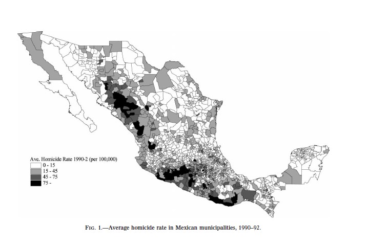
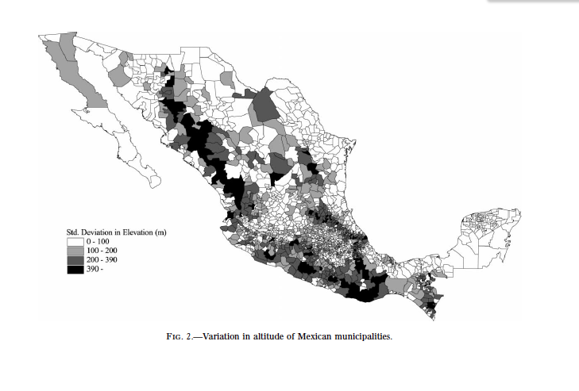
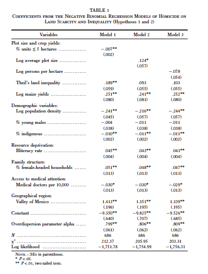
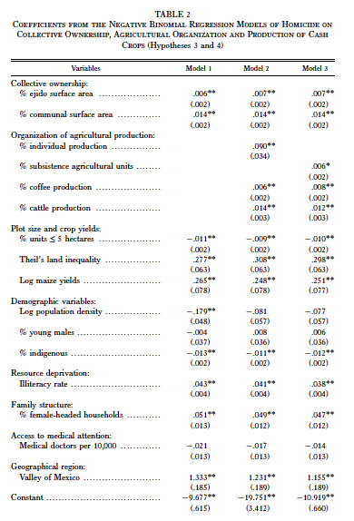
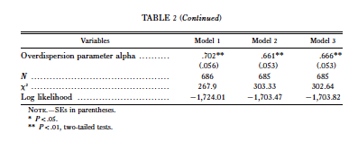
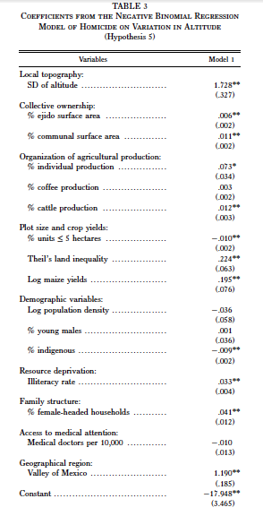
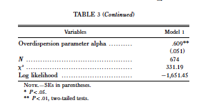

We chose to replicate Andrés Villarreal's 2004 AJS paper, "The Social Ecology of Rural Violence: Land Scarcity, the Organization of Agricultural Production, and the Presence of the State." Applying an ecological theory of crime to the study of rural violence in Mexico, Villarreal attempts explain the fact that rural municipalities have high variation in homicide rates by investigating the effects of land distribution, collective ownership, and the organization of agricultural production on homicide rates. He tests five specific hypotheses: (1) When agricultural land is scarce relative to the number of individuals, there will be more conflict and therefore more homicides; (2) An unequal distribution of land will lead to more violent conflict; (3) When property rights are not well enforced or are contingent, there will be more conflict over lands. For this reason, ejido and communal units will experience more violence; (4) agricultural production systems that involve more commodified relations of production and exchange will be associated with a breakdown of community social cohesion and therefore with more violence, and the introduction of cash crops will lead to greater conflict over resources and control over trade, and consequently to more violence; and (5) remote mountainous areas will have higher rates of violence due to the absence of state institutions.

**Preparing the Dataset for Analysis:**

"The hypotheses [...] are tested using a sample of rural municipalities [counties] in Mexico. [...] The sample of rural municipalities is constructed by selecting all municipalities in which more than 75% of the population lives in towns of less than 2,500 residents. [...] Municipalities belonging to the state of Oaxaca were grouped into 30 districts commonly used for statistical purposes. [...] A total of 697 municipalities (37% of all municipalities in the country) satisfy this criterion and are therefore included in the sample (minus some eliminated due to missing values). [...] The number of homicides are obtained from vital statistics compiled by the Mexican government. [...] In order to smooth out yearly fluctuations, the total number of homicides over a three-year period (1990– 92) is used, and the population at risk is assumed to be three times the municipal population." [...] The variables for land scarcity, collective ownership, and the organization of agricultural production are all drawn from the 1991 Agricultural and Livestock Census [...] 

I measure the scarcity of land for the sample of rural municipalities (hypothesis 1) in three different ways: the percentage of rural production units of five hectares of land or less, the log of the average plot size, and the log of persons per hectare of agricultural land. [...] Because the extent to which small plots of land satisfy the needs of residents will depend on the quality of the land, I introduce the log of maize yields (expressed as tons per hectare) along with each indicator of land scarcity in the regression models. [...] 

The degree of land inequality (hypothesis 2) is measured by adapting an indicator commonly used for income inequality known as Theil’s index. [...] The index of land inequality is given by: T = 1/u_tot * (summation from i=1 to G) (u_i)z_iln(z_i), where z_i = (s_i/u_i)/(s_tot/u_tot) is the ratio of the average plot size for agricultural units in plot size category i (their entire surface area s_i over the number of units u_tot) and G is the number of plot size categories. [..] The eight plot size categories are less than 2 hectares; 2–5 hectares; 5–20 hectares; 20–50 hectares; 50–100 hectares; 100–1,000 hectares; 1,000–2,500 hectares; and more than 2,500 hectares. 

In order to test the third hypothesis regarding the effect of contingent or not well-enforced property rights (hypothesis 3), I enter the percentage of the rural surface area in each municipality constituted by ejidos and communal units according to the Agricultural and Livestock Census into the regression models. [...]

I measure the impact of the relations of agricultural production (hypothesis 4) using two different indicators. First, I enter the percentage of subsistence agricultural units, defined as those producing only for internal consumption within the household and not for sale in the market. [...] The second measure I use to test the impact of the relations of production is the percentage of agricultural units with individual (as opposed to group) organization of production. [...] Finally, I test the effect of cash crop production on homicidal violence using the percentage of units dedicated to harvesting coffee and raising cattle.

Six control variables are introduced in the regression models [...] First, I introduce the log of the population density as a measure of the degree of public social interaction. [...] The percentage of the population constituted by young males ages 15–29 is included as a measure of the age structure of the population. [...] The ethnic composition of a municipality is accounted for by using the percentage of residents five years of age or older who speak an indigenous language. [...] The illiteracy rate is used as an indicator of resource deprivation. [...] The percentage of female-headed households was also found to be an important predictor of homicide rates
in previous work and is therefore included in the regressions below.[...] A dummy variable is also introduced in the regression models to control for the municipalities located in the state of Mexico. Although some of these municipalities are technically rural, they are located in the Valley of Mexico in close proximity to Mexico City and tend to have higher homicide rates compared to the rest of the country, even when accounting for basic structural factors. 

Finally, as described above, a measure of the local topography is used to test the effect of access to state institutions on the rate of homicidal violence [the standard deviation of elevation in a municipality]. However, remote rural areas are not only farther from the reach
of state institutions, they are also farther from medical services. [...] I therefore introduce the number of medical doctors in the municipality per 10,000 residents according to the 1990 census as a predictor of homicide rates in all the regression models.""

*Data were added to the dataset for analysis in order of data source - i.e. all data from the standard census first, then population density (which requires map data about the area of municipalities), then homicides, then the dummy variable. Data drawn from the Agricultural Census were added next, as they required matching by name instead of municipality code due to the format of the raw data. Once these data were combined into the main analytical dataframe, all relevant variables were computed, and then elevation data was added. Data regarding the state of Oaxaca were separated out through this process, as this state counts municipalities differently - each town is counted as its own municipality, which would skew the data. As noted above, Oaxacan municipalities are typically grouped into 30 districts for analysis--we completed this operation after creating the main analytical dataframe, recalculated all variables for the Oaxacan districts, and merged the two dataframes by municipality code.*


```{r, warning=FALSE, error=FALSE}
library(ggplot2)
library(dplyr)
library(xlsx)
library(zoo)
library(foreign)
library(tidyr)
library(gdata)
library(maptools)
library(gpclib) 
library(RColorBrewer)
library(scales)
library(SDMTools)
```

**Municipalities, Indigenous Language-Speakers, Illiteracy**
```{r, warning=FALSE, error=FALSE}
#load main 1990 censo database from inegi to the town level
censo90 <- read.table("data/censo_1990_37_var.txt", header = TRUE, sep = "\t", encoding = "latin1")

#create table with variables of interest and population
censo.1 <- tbl_df(censo90) %>%
  filter(mun !=0 ) %>%
  select(state = entidad, mun, twn = loc, total.pop = p_total, no.literacy1 = analfbet,
         no.literacy2 = pob_no_l, n_hab_esp, habla_esp, state_name = nom_ent, mun_name = nom_mun) %>%
  mutate(indi = as.numeric(as.character(n_hab_esp)) + as.numeric(as.character(habla_esp)), 
         muncode = (state * 1000) + mun, no.literacy1 = as.numeric(as.character(no.literacy1)), 
         no.literacy2 = as.numeric(as.character(no.literacy2)), no.literacy = no.literacy1 + no.literacy2) %>%
  filter(muncode > 1000) %>%
  select(muncode, twn:indi, no.literacy, -state, -mun, -no.literacy1:-habla_esp)

#create variable for population in towns of less than 2500 population
mun.total <- censo.1 %>%
  filter(twn == 0)

less.2500 <- censo.1 %>%
  filter(twn != 0 & twn != 9998 & twn != 9999, total.pop < 2500) %>%
  group_by(muncode) %>%
  summarise (pop.less.2500 = sum(total.pop))

mun.total <- left_join(mun.total, less.2500, by = "muncode")

#change names to capital letters and remove accents
mun.total$state_name <- toupper(mun.total$state_name)
mun.total$state_name <- gsub("`|\\'", "", iconv(mun.total$state_name, to="ASCII//TRANSLIT"))
mun.total$state_name <- gsub("COAHUILA DE ZARAGOZA", "COAHUILA", mun.total$state_name)
mun.total$state_name <- gsub("VERACRUZ DE IGNACIO DE LA LLAVE", "VERACRUZ", mun.total$state_name)
mun.total$state_name <- gsub("MICHOACAN DE OCAMPO", "MICHOACAN", mun.total$state_name)

#change names to capital letters and remove accents
mun.total$mun_name <- toupper(mun.total$mun_name)
mun.total$mun_name <- gsub("`|\\'", "", iconv(mun.total$mun_name, to="ASCII//TRANSLIT"))
mun.total$mun_name <- gsub("~","", mun.total$mun_name)
mun.total$mun_name <- gsub("\"","", mun.total$mun_name)
```

**Doctors**
```{r, warning=FALSE, error=FALSE}
#create table with number of doctors by municipality 
docs <- read.csv(file="data/doctors_censo1990.csv", header=TRUE, skip = 4, encoding = "latin1")
docs <- tbl_df(docs)

##clean out NAs and others. 
docs <- docs %>%
  select(muncode = Clave, total = Total, doctors = Medicina) %>%
  mutate(doctors = as.numeric(as.character(doctors))) %>%
  filter(!grepl("996|997", muncode), muncode > 1000)

docs[is.na(docs)] <- 0
```

**Female-Headed Households**
```{r, warning=FALSE, error=FALSE}
fems <- read.csv(file="data/headhome_censo1990.csv", header=TRUE, skip = 4, encoding = "latin1")
fems <- tbl_df(fems)

#clean out NAs and others.
fems <- fems %>%
  select(muncode = Clave, total.house = Total, fem.house = Mujeres) %>%
  filter(!grepl("996|997", muncode), muncode > 1000)

fems[is.na(fems)] <- 0
```

**Young Males**
```{r, warning=FALSE, error=FALSE}
men <- read.csv(file="data/censo_1990_age.csv", header=FALSE, skip = 7, encoding = "latin1")
men <- tbl_df(men)

#clean out NAs and others.
young <- men %>%
  select(muncode = V1, up19 = V7, up24 = V8, up29 = V9) %>%
  filter(muncode != "#NAME?") 

#remove commas from data.
young$muncode <- gsub(" ","",young$muncode)
young$up19 <- gsub(",","",young$up19)
young$up24 <- gsub(",","",young$up24)
young$up29 <- gsub(",","",young$up29)

#create variable with total young men from 15 years old to 29
young <- young %>%
  mutate(muncode = as.numeric(as.character(muncode)),
         up19 = as.numeric(as.character(up19)),
         up24 = as.numeric(as.character(up24)),
         up29 = as.numeric(as.character(up29))) %>%
  filter(!is.na(muncode)) %>%
  mutate(young.total = up19+up24+up29)
```

**Population Density**
```{r, warning=FALSE, error=FALSE}
#pull data with municipal area in meters to calculate population density, there is no GIS map, for 1990, oldest one is 1995.
map1995 <- read.dbf("data/inegi_map1995.DBF")
map1995 <- tbl_df(map1995)

#area of each municipality in squared kilometers
area <- map1995 %>%
  mutate(muncode = paste(CVE_ENT, CVE_MUN, sep =""), sqkm = (AREA/1000^2)) %>%
  mutate(muncode = as.numeric(as.character(muncode))) %>%
  select(muncode, sqkm)
```

**Homicides**
```{r, warning=FALSE, error=FALSE}
homicides <- read.csv(file="data/homicide_1990_2013_INEGI.csv", header=FALSE, skip = 6, encoding = "latin1")
homicides <- tbl_df(homicides) %>%
  select(-V3:-V23)

#new column names, default were unreadable
colnames(homicides) <- c("muncode", "Nombre", "hom.1992", "hom.1991", "hom.1990")
homicides[is.na(homicides)] <- 0

#clean out NAs and others, sum 1990,1991, 1992
homicides <- homicides %>%
  filter(!grepl("996|997|998|991|993|992", muncode), muncode > 1000) %>%
  mutate(hom.total = hom.1992+ hom.1991 + hom.1990) %>%
  select(muncode, hom.total)
```

**CREATING THE MAIN DATAFRAME OF DATA FROM STANDARD CENSUS, PLUS HOMICIDES**
**Adding Dummy Variable for State of Mexico**
```{r, warning=FALSE, error=FALSE}
#join all new variables to creat the main data frame with control and dependent variables
main <- left_join(mun.total, area, by = "muncode")
main <- left_join(main, docs, by = "muncode")
main <- left_join(main, fems, by = "muncode")
main <- left_join(main, young, by = "muncode")
main <- left_join(main, homicides, by = "muncode")

#adding dummy variable for state of Mexico and creating name variable in order to join with agricultural variables dataframe later
main <- main %>% 
  mutate(dummy.SOM = as.numeric(muncode %in% 15001:15125)) %>%
  mutate(name = paste(mun_name, state_name, sep = ", "))
```

**Agricultural Data**
```{r, warning=FALSE, error=FALSE}
#load all the files
prod_units <- read.csv(file="data/censo_agricola_1991_produnits.csv", header=FALSE, skip = 8, stringsAsFactors = FALSE, encoding = "UTF-8")
prod_units <- tbl_df(prod_units)
land <- read.csv(file="data/censo_agricola_1991_land_area.csv", header=FALSE, skip = 8, stringsAsFactors = FALSE, encoding = "UTF-8")
land <- tbl_df(land)
subs <- read.csv("data/censo_agricola_1991_autoconsumo.csv", header = FALSE, skip = 11, stringsAsFactors = FALSE, encoding = "UTF-8")
subs <- tbl_df(subs)
cattle <- read.csv("data/censo_agricola_1991_cattle.csv", header = FALSE, skip = 10, stringsAsFactors = FALSE, encoding = "UTF-8")
cattle <- tbl_df(cattle)
coffee <- read.csv("data/censo_agricola_1991_coffee.csv", header = FALSE, skip = 1069, nrows = 1262, stringsAsFactors = FALSE, encoding = "UTF-8")
coffee <- tbl_df(coffee)
corn <- read.csv("data/censo_agricola_1991_corn.csv", header = FALSE, skip = 6187, nrows = 2426, stringsAsFactors = FALSE, encoding = "UTF-8")
corn <- tbl_df(corn)

#function that corrects municipality names in each dataframe and creates a new variable with pasted municipality name and state. A dataframe is inputted; the function deletes leading spaces before names (which messes up the matching), and selects and converts to character/numeric relevant variables for each dataset (V1-V7). The structure of the raw data is such that a state is only specified on the observation line above the list of municipalities in that state -- the function then assigns "NA" values to places where a state is not listed (meaning that the line is a municipality, not a state) and the same to where the municipality is not listed (meaning that the line is a state) removes special characters (i.e. spanish alphabet letters) and then uses the na.locf() function to create a variable matching municipalities to the state they are in. The function then cleans the municipality name variable and pastes the state and municipality names together and outputs a unique "name" variable for each state/mun pair.

naming <- function(df) {
  df$V3 <- gsub("[[:space:]]", "", df$V3)
  df$V4 <- gsub("[[:space:]]", "", df$V4)
  df$V5 <- gsub("[[:space:]]", "", df$V5)
  df$V6 <- gsub("[[:space:]]", "", df$V6)
  df$V7 <- gsub("[[:space:]]", "", df$V7)
  
  df1 <- df %>%
    select(state = V1, mun = V2, V3, V4, V5, V6, V7) %>%
    mutate(state = as.character(state), mun = as.character(mun), 
           V3 = as.numeric(V3), V4 = as.numeric(V4),
           V5 = as.numeric(V5), V6 = as.numeric(V6)  , V7 = as.numeric(V7))           
  
  df1$state[df1$state == ""] <- NA
  df1$mun[df1$mun == ""] <- NA
  df1$mun <- gsub("\x84", "N",df1$mun) 
  df1$state <- na.locf(df1$state)
  
  df1 <- df1 %>%
    separate(mun, into = c("mun", "art"), sep = ",", extra = "merge") %>%
    trim(df1$art) %>% 
    mutate(mun = ifelse(!is.na(art), paste(art, mun, sep = " "), mun)) %>%
    filter(!is.na(mun)) %>%
    mutate(name = paste(mun, state, sep = ", ")) %>%
    select(-art)
  
  #outputs variable with names in format "municipality, state"
}

#run the naming function for each file
prod_units <- naming(prod_units)
land <- naming(land)
subs <- naming(subs)
cattle <- naming(cattle)
corn <- naming(corn)
coffee <- naming(coffee)

#get total producton units
prod_units[is.na(prod_units)] <- 0
prod.units1 <- prod_units %>%
  select(name, total_prod_units = V3) %>%
  mutate(total_prod_units = as.numeric((total_prod_units)))
```

**Ejidal and Communal Land, and Land for Individual Production**
```{r, warning=FALSE, error=FALSE}
#tabulate land surface area according to property type, and remove all special characters that produce errors when read into R. The list of characters below are all errors produced in reading in a modified "n" character.
land[is.na(land)] <- 0
land$name <- gsub("[^[:alnum:][:blank:],.()-///' ]", "N", land$name)

land1 <- land %>%
  select(name, total_area = V3, ejidal = V4, 
         comunal = V5,  private = V6) %>%
  mutate(total_area = as.numeric((total_area)), 
         ejidal = as.numeric(ejidal), 
         comunal = as.numeric(comunal), 
         private = as.numeric(private))
```

**Subsistence Farming**
```{r, warning=FALSE, error=FALSE}
#calculate units dedicate to subsistance farming
subs[is.na(subs)] <- 0

subs1 <- subs %>%
  select(name, total_units = V5, subs_units = V6) %>%
  mutate(total_units = as.numeric((total_units)), 
         subs_units = as.numeric(subs_units))
```

**Cattle Production Units**
```{r, warning=FALSE, error=FALSE}
#units with cattle needs to be calculated from total production units.
cattle[is.na(cattle)] <- 0

cattle1 <- cattle %>%
  select(name, total.cattle.units = V5) 
```

**Coffee Production Units**
```{r, warning=FALSE, error=FALSE}
coffee[is.na(coffee)] <- 0

coffee1 <- coffee %>%
  select(name, total.coffee.units = V4) 
```

**Maize Yield**
```{r, warning=FALSE, error=FALSE}
#maize yields in ton per hectare
corn$V5[is.na(corn$V5)] <- 0
corn$V6[is.na(corn$V6)] <- 0
corn$V7[is.na(corn$V7)] <- 0

corn1 <- corn %>%
  select(name, corn.ha = V5, corn.tons = V7) 
```

**MERGE AGRICULTURAL DATA WITH MAIN DATAFRAME**
```{r, warning=FALSE, error=FALSE}
#join agricultural variables 
agr_var <- left_join(prod.units1, land1, by = "name")
agr_var <- left_join(agr_var, subs1, by = "name" )
agr_var <- left_join(agr_var, corn1, by = "name" )
agr_var <- left_join(agr_var, cattle1, by = "name" )
agr_var <- left_join(agr_var, coffee1, by = "name" )

#function correct_mun to change the of municipalities to match main data frame and agricultural variables. A handful of municipality names between the agricultural variable df and the main df do not match --- the name is slightly different in each dataset (i.e. with extra spaces between words, or an extra appended word, or there was a transcription error), so the names won't match even though they refer to the same place. The below function reads in a dataframe of errors we created in which the names from both datasets that contain errors are placed next to each other (i.e. in a census variable and an agricultural variable), such that the name versions in the agricultural dataset can be replaced with the versions from the census file, resolving the conflict.

#load dataframes with common mistakes in municipality names
errors <- read.csv("data/mun_name_errors.csv", header = TRUE)


#function correct_mun to change the of municipalities to match main data frame and agricultural variables 
correct_mun <- function(x, pattern, replace) {
  for (i in seq_along(pattern))
    x <- gsub(pattern[i], replace[i], x, fixed = TRUE)
  x
}

agr_var$name <- correct_mun(agr_var$name, 
                            errors$agricola1991, errors$censo1990)

#join main dataframe with agricultural variables
agr_var[is.na(agr_var)] <- 0
df <- full_join(agr_var, main, by = "name")

```

**Theil Index and proportion of plots of 5 HA or less**
```{r, warning=FALSE, error=FALSE}
#load data for plot size, 6 categories, skip 15 irrelevant lines
plot_size <- read.csv("data/censo_agricola_1991_plotsize.csv", skip = 15, 
                      nrows = 16038, stringsAsFactors = FALSE)

#select vectors and rename them to make then legible
plot_size <- tbl_df(plot_size) %>%
  select(state = X00, mun = X, state.name = X.1, mun.name = X.2,
         size = MAS.DE.2500.HA., units = X1.625, area.ha =  X1.127.522.14)

#add NAs to blank spaces in state and municipality names
plot_size$state.name[plot_size$state.name == ""] <- NA
plot_size$mun.name[plot_size$mun.name == ""] <- NA

#loop to identify with a 0 value totals for states. 
for (i in 1:nrow(plot_size)) {
  if (!is.na(plot_size$state.name[i])) {
    plot_size$mun[i] <- 0
  }
}

#add mun numbers to all NAs taking the last number as the value
plot_size$mun <- na.locf(plot_size$mun) 

#filter out state total identified with a 0 mun number
plot_size <- plot_size %>%
  filter(mun != 0) %>%
  select(-state.name) %>%
  mutate(muncode = (state * 1000) + mun)
  
#add mun names to all NAs taking the last available name as the value
plot_size$mun.name <- na.locf(plot_size$mun.name)

#add NAs to all missing values in the size vector in order to identify, municipal totals
plot_size$size[plot_size$size == ""] <- NA

#substitute with NA the "*" present in some observations for units, and strip out all blank space from the units vector
plot_size$units[plot_size$units == "*"] <- NA
plot_size$units <- gsub("[[:space:]]", "", plot_size$units)
plot_size$area.ha<- gsub("[[:space:]]", "", plot_size$area.ha)

#change class of the units vector to character
plot_size$units <- as.numeric(plot_size$units)
plot_size$area.ha <- as.numeric(plot_size$area.ha)

#create dataframe with total number of units by municipality
total_units <- plot_size %>%
  filter(is.na(size)) %>% # NAs were used to filter only the municipality totals
  select(muncode, plot.total = units, area.total = area.ha)

#create data frame with plots that are 5 HA or less, sum their totals
plot_upto5 <- plot_size %>%
  filter(size ==  "HASTA    2 HA." | size == "MAS DE    2 HASTA    5 HA.", !is.na(units)) %>%
  group_by(muncode) %>%
  summarise(units.to5 = sum(units)) %>%
  mutate(size = "HASTA 5 HA.")

#join data frames for total units and 5 HA or less 
plot_upto5 <- left_join(total_units, plot_upto5, by = "muncode") %>%
  select(muncode, plot.total, units.to5, area.total)

df <- left_join(df, plot_upto5, by = "muncode")
```


**Separate Oaxaca and Main Dataframe for Variable Calculation**
```{r, warning=FALSE, error=FALSE}
#separate out Oaxaca data for calculation due to different municipality definition. Oaxacan municipal codes run from 20001:20570.
df.main <- filter(df, !(muncode %in% 20001:20570))
df.oax <- filter(df, muncode %in% 20001:20570)
```

**Calculate all Variables in Main Dataframe**
```{r, warning=FALSE, error=FALSE}

#create all calculated variables
df.main <- df.main %>%
  mutate(prop.less.2500 = pop.less.2500/total.pop, pct.indi = (indi/total.pop) * 100, 
         no.lit.rate = (no.literacy/total.pop) * 100, 
         docs.per.10k = (doctors/total.pop) * 10000, 
         pct.fem.house = (fem.house/total.house) * 100,
         pct.young = (young.total/total.pop) * 100,
         log.pop.dens = log10(total.pop/sqkm),
         hom.rate = hom.total/(total.pop*3) * 100000,
         pct.ej = (ejidal/total_area) * 100, 
         pct.com = (comunal/total_area) * 100, 
         pct.individual = (private/total_area) * 100,
         pct.subs = (subs_units/total_units) * 100, 
         log.corn.yield = log10(corn.tons/corn.ha), 
         pct.cattle = (total.cattle.units/total_prod_units) * 100,
         pct.coffee = (total.coffee.units/total_prod_units) * 100,
         log.pop.surface = log10(total.pop/total_area), 
         pct.upto5 = (units.to5/plot.total) * 100, 
         log.avg.plot = log10(area.total/plot.total)) %>%
  select(-twn, -no.literacy, -indi, -pop.less.2500, -doctors, -fem.house, -total.house, -young.total, -sqkm, -hom.total, -ejidal, -total_area, -comunal, -private, -up19, -up24, -up29, -total, -total_prod_units, -total_units, -corn.tons, -corn.ha, -total.cattle.units, -subs_units, - total.coffee.units)

#fixing error values produced through calculation (dividing by 0, etc.)
df.main$log.corn.yield <- gsub("NaN", "0", df.main$log.corn.yield)
df.main$log.corn.yield <- gsub("-Inf", "0", df.main$log.corn.yield)
df.main$log.pop.surface <- gsub("-Inf", "0", df.main$log.pop.surface)

#many NAs here, because only municipalities with coffee production were included in dataset. As such, an NA indicates 0 coffee production. 
df.main$pct.coffee[is.na(df.main$pct.coffee)] <- 0
```

**Compute Theil Index**
```{r, warning=FALSE, error=FALSE}
theil_prep <- left_join(plot_size, total_units, by = "muncode") %>%
  filter(!is.na(size)) %>%
  select(muncode, theil.area = area.ha, theil.units = units, theil.area.total = area.total, plot.total)

theil_index <- filter(theil_prep, !(muncode %in% 20001:20570))

theil_index <- theil_index %>%
  mutate(z1 = (theil.area/theil.units)/(theil.area.total/plot.total)) %>% # calculate z1
  group_by(muncode, plot.total) %>%
  summarise(summation = sum((theil.units*z1)*log(z1), na.rm = TRUE)) %>% #calculate summation
  mutate(theil = (1/plot.total)*summation) %>%
  select(muncode, theil)

#join theil index with main data frame
df.main <- left_join(df.main, theil_index, by = "muncode")

#separate theil prep totals for Oaxaca
plot_size.oax <- filter(plot_size, muncode %in% 20001:20570) 
total_units.oax <- filter(total_units, muncode %in% 20001:20570) 
```


**Elevation**
```{r, warning=FALSE, error=FALSE}
#information does not come directly from the census, but from the catalog of town names from 1990. 
catalog <- read.csv("data/ARCH271.CSV")


catalog <- tbl_df(catalog)

#select variables create muncodes, filter NAs
elev <- catalog %>%
  select(state = CVE_ENT, mun = CVE_MUN, twn = CVE_LOC, elev = ALTITUD) %>%
  mutate(state = as.numeric(as.character(state)), mun = as.numeric(as.character(mun)), 
         elev = as.numeric(as.character(elev)), muncode = (state*1000) + mun, twn = as.numeric(twn)) 

elev[elev == ""] <- NA
elev <- elev %>%
  filter(!is.na(elev)) %>%
  select(-state, -mun)

#separate out oaxaca 
elev.oax <- filter(elev, muncode %in% 20001:20570) 
elev <- filter(elev, !(muncode %in% 20001:20570))

#table with standard deviation for elevation among towns in a municipality
elev.sd <- elev  %>% 
  group_by(muncode) %>%
  summarise(sd.elev = sd(elev))

elev.sd$sd.elev[is.na(elev.sd$sd.elev)] <- 0
df.main <- left_join(df.main, elev.sd, by = "muncode")

## sd elevation weighted by population

##create data frame with population at the town level
censo.2 <- tbl_df(censo90) %>%
  filter(mun !=0 ) %>%
  select(state = entidad, mun, twn = loc, total.pop = p_total) %>%
  mutate(muncode = (state * 1000)+mun) %>%
  filter(muncode > 1000) %>%
  filter(twn != 0 & twn != 9998 & twn != 9999) #filter undeterminded town data

##join population and elevation by muncode and town
pop_elev <- left_join(censo.2, elev, by = c("muncode", "twn"))

## filter out the Oaxaca data frame
pop_elev.main <- filter(pop_elev, !(muncode %in% 20001:20570))
pop_elev.oax <- left_join(censo.2, elev.oax, by = c("muncode", "twn")) %>%
  filter(muncode %in% 20001:20570)

## calculate sd elevation weighted by population group by municipality
weigh_elev.main <- pop_elev.main %>% 
  group_by(muncode) %>% 
  summarise(weigh.elev = wt.sd(elev, total.pop)) # use SDMTools to calculate weighted sd

df.main <- left_join(df.main, weigh_elev.main, by = "muncode")
```

**Filter to Main Sample**
```{r, warning=FALSE, error=FALSE}
#store version of homicide rate and sd.elev for maps. this does not include Oaxaca
main.for.map <- select(df.main, muncode, hom.rate, sd.elev)

#filter out all municipalities with more than 75% of pop living in towns of less than 2500 pop 
sample.main <- filter(df.main, prop.less.2500 > .75)
```

**CONVERTING AND CALCULATING DATA FOR OAXACA**
```{r, warning=FALSE, error=FALSE}
#load table with conversion table between municipalities and distritos for Oaxaca
oaxaca.distritos <- read.xlsx("data/oaxaca_30distritos_2002.xls", 3, startRow = 5, endRow = 690, encoding = "latin1")

oaxaca.distritos <- tbl_df(oaxaca.distritos) 

#create table with municipality codes 
distritos <- oaxaca.distritos  %>%
  select(mun = CLAVE) %>%
  filter(!is.na(mun)) %>%
  mutate(mun = as.numeric(as.character(mun)), 
         muncode = (mun + 20000))

#create column that assigns districts to each muncode
distritos$distrito = rep(NA, nrow(distritos))
distritos$distrito[is.na(distritos$mun)] <- c(1:30)
distritos$distrito <- na.locf(distritos$distrito)

#filter out NA rows with district names
distritos <- distritos %>%
  filter(!is.na(mun))

#join district table with oaxaca population table by district and generate new muncodes with district number. filter out new municipalies(districts) with more than 75% of population living in towns of less than 2500.
df.oax$pop.less.2500[is.na(df.oax$pop.less.2500)] <- 0

oaxaca.dist <- left_join(distritos, df.oax, by = "muncode") 
oaxaca.dist <-filter(oaxaca.dist, !(is.na(name))) 

#fixing entries for a town that didn't match due to strange naming. These hard-coded values come from the town "Guemez" in the state of Tamaulipas - the state name has an umlaut in it which produces errors when read into R that cannot be captured by other regular expressions. This data is retrieved from the raw data and inputted.
oaxaca.dist$ejidal[156] <- 0
oaxaca.dist$comunal[156] <- 0
oaxaca.dist$private[156] <- 399.35
oaxaca.dist$total_area[156] <- 399.35

#calculate the rest of the variables by summing municipality values into total district values and then applying relevant calculations, create new municipality codes to correspond with districts
oaxaca.dist <- oaxaca.dist  %>% 
  group_by(distrito) %>% 
  summarise(pop.less.2500 = sum(pop.less.2500), 
            total.pop = sum(total.pop), 
            prop.less.2500 = pop.less.2500/total.pop,
            indi = sum(indi), 
            pct.indi = (indi/total.pop) * 100, 
            no.literacy = sum(no.literacy), 
            no.lit.rate = (no.literacy/total.pop) * 100,
            sqkm = sum(sqkm), 
            log.pop.dens = log10(total.pop/sqkm), 
            doctors = sum(doctors), 
            docs.per.10k = (doctors/total.pop)*10000, 
            fem.house = sum(fem.house), 
            total.house = sum(total.house), 
            pct.fem.house = (fem.house/total.house) * 100,
            young.total = sum(young.total), 
            pct.young = (young.total/total.pop) * 100, 
            hom.total = sum(hom.total), 
            hom.rate = hom.total/(total.pop*3)*100000,
            ejidal = sum(ejidal), 
            total_area = sum(total_area), 
            log.pop.surface = log10(total.pop/total_area), 
            pct.ej = (ejidal/total_area) * 100,
            comunal = sum(comunal), 
            pct.com = (comunal/total_area) * 100,
            private = sum(private), 
            pct.individual = (private/total_area) * 100,
            total.cattle.units = sum(total.cattle.units), 
            total_prod_units = sum(total_prod_units), 
            pct.cattle = (total.cattle.units/total_prod_units) * 100,
            subs_units = sum(subs_units), 
            total_units = sum(total_units), 
            pct.subs = (subs_units/total_units) * 100,
            corn.tons = sum(corn.tons), 
            corn.ha = sum(corn.ha), 
            log.corn.yield = log10(corn.tons/corn.ha),
            total.coffee.units = sum(total.coffee.units), 
            pct.coffee = (total.coffee.units/total_prod_units) * 100, 
            plot.total = sum(plot.total), 
            units.to5 = sum(units.to5), 
            pct.upto5 = (units.to5/plot.total) * 100, 
            area.total = sum(area.total), 
            log.avg.plot = log10(area.total/plot.total)) %>%
  select(-no.literacy, -indi, -pop.less.2500, -doctors, -fem.house, -total.house, -young.total, -sqkm, -hom.total, -ejidal, -total_area, -comunal, -private, -total_prod_units, -corn.tons, -total.cattle.units, -subs_units, -total_units, -corn.tons, -corn.ha) %>%
  mutate(muncode = distrito + 20000)

#many NAs here, because only municipalities with coffee production were included in dataset. As such, an NA indicates 0 coffee production. 
oaxaca.dist$pct.coffee[is.na(oaxaca.dist$pct.coffee)] <- 0

## ADDING SD ELEVATION WEIGHTED BY POPULATION TO OAXACA

## join population and elevation data frame with distritos in oaxaca 
pop_elev.dis <- left_join(pop_elev.oax, distritos, by = "muncode")

## calculate sd elevation weighted by population grouped by distrito
weigh_elev.oax <- pop_elev.dis %>% 
  group_by(distrito) %>% 
  summarise(weigh.elev = wt.sd(elev, total.pop)) %>% # use SDMTools to calculate weighted sd
  mutate(muncode = 20000 + distrito) %>%
  select(-distrito)

## join weighted elevation with oaxaca main data frame
oaxaca.dist <- left_join(oaxaca.dist, weigh_elev.oax, by = "muncode")

#calculate theil index for oaxaca by distrito. join distritos with total units for oaxaca, calculate values for distritos
total_units.oax <- left_join(distritos, total_units.oax, by = "muncode") %>%
  group_by(distrito) %>%
  summarise(plot.total = sum(plot.total), area.total = sum(area.total))

#join distritos and plot dized for oaxaca, calculate units and area by size for distritos
plot_size.oax <- left_join(distritos, plot_size.oax, by = "muncode") %>%
  select(muncode, distrito, units, area.ha, size) %>%
  filter(!is.na(size)) %>%
  group_by(distrito, size) %>%
  summarise(units = sum(units, na.rm = TRUE), area.ha = sum(area.ha, na.rm = TRUE))

#join plot size and totals for distritos in oaxaca in order to calculate theil index
theil_prep.oax <- left_join(plot_size.oax, total_units.oax, by = "distrito")

#calculate theil index and turn distritos into muncodes. Not sure about what to do with Inf and NaN values, removed NAs from calculation in order to keep more observations
theil_index.oax <- theil_prep.oax %>%
  mutate(z1 = (area.ha/units)/(area.total/plot.total)) %>% # calculate z1
  group_by(distrito, plot.total) %>%
  summarise(summation = sum((units*z1)*log(z1), na.rm = TRUE)) %>% #calculate summation
  mutate(theil = (1/plot.total)*summation) %>%
  select(distrito, theil) %>%
  mutate(muncode = distrito + 20000)
  
#join theil index for oaxaca with oaxaca distrito data frame
oaxaca.dist <- left_join(oaxaca.dist, theil_index.oax, by = "muncode")

#calculate SD of elevation for map and dataframe, and state of mexico dummy variable and add them to the oaxaca dataset
elev.map.oax <- left_join(distritos, elev.oax, by = "muncode") %>%
  group_by(distrito) %>%
  mutate(sd.elev = sd(elev)) %>%
  select(muncode, sd.elev)

elev.map.oax <- elev.map.oax[!duplicated(elev.map.oax), ]

elev.oax <- left_join(distritos, elev.oax, by = "muncode") %>%
  group_by(distrito) %>%
  summarise(sd.elev = sd(elev)) %>%
  mutate(muncode = distrito + 20000, dummy.SOM = 0) %>%
  select(muncode, sd.elev, dummy.SOM)

oaxaca.dist <- left_join(oaxaca.dist, elev.oax, by = "muncode")

#select variables for dataframe used in map for Oaxaca
oax.for.map <- select(oaxaca.dist, muncode, hom.rate, sd.elev)

#filter to oaxaca sample 
sample.oax <- oaxaca.dist %>%  
  filter(prop.less.2500 > .75) 
  
#create a table to keep at hand showing which of the municipalities  is in which distrito
oaxaca.mun <- df.oax %>%
  left_join(distritos, df.oax, by = "muncode") %>%
  select(muncode, pop.less.2500, total.pop, distrito) 
```

**JOIN OAXACA AND MAIN DATAFRAMES TO FINAL SAMPLE**
```{r, warning=FALSE, error=FALSE}
sample.main <- sample.main %>%
  select(muncode, total.pop, dummy.SOM, prop.less.2500, pct.indi, no.lit.rate, docs.per.10k, pct.fem.house, pct.young, log.pop.dens, hom.rate, pct.ej, pct.com, pct.individual, pct.subs, log.corn.yield, pct.cattle, sd.elev, log.pop.surface, pct.upto5, pct.coffee, theil, log.avg.plot, weigh.elev)

sample.oax <- sample.oax %>%
  select(muncode, total.pop, dummy.SOM, prop.less.2500, pct.indi, no.lit.rate, docs.per.10k, pct.fem.house, pct.young, log.pop.dens, hom.rate, pct.ej, pct.com, pct.individual, pct.subs, log.corn.yield, pct.cattle, sd.elev, log.pop.surface, pct.upto5, pct.coffee, theil, log.avg.plot, weigh.elev)

sample <- rbind(sample.main, sample.oax)


#fix log corn yield, which was somehow coded as a character string
sample$log.corn.yield <- as.numeric(sample$log.corn.yield)

#missed an error in calculated variable earlier - (produced by taking log of 0)
sample$log.pop.surface[sample$log.pop.surface == "Inf"] <- 0 

#fix log pop surface, which was somehow coded as a character string
sample$log.pop.surface <- as.numeric(sample$log.pop.surface)

#round homicide rate to whole number, so appropriate for negative binomial regression
sample$hom.rate <- round(sample$hom.rate, digits = 0)
```

**Visualizing Homicide Rates and Variation in Altitude in Mexican Municipalities**

Villarreal produced two maps with overlaid data as part of the paper; one showed homicide rates in Mexican municipalities, and the other showed the standard deviation of elevation in Mexican municipalities:





```{r results='hide', message=FALSE, warning=FALSE}
library(ggplot2)
library(classInt)
gpclibPermit()
```

**Prepare Maps**
*Using 1995 data because difference between 1995 and 1990 data is negligible*
```{r, warning=FALSE, error=FALSE}

#map.data <- rbind(main.for.map, oax.for.map)
# 
# map.dbf <-read.dbf("data/maps/municipios1995-distritos.dbf")
# #map.dbf <- map.dbf %>%
#    #mutate(CVE_MUN = as.numeric(as.character(CVE_MUN)),
#    #       CVE_ENT = as.numeric(as.character(CVE_ENT)),
#    #       muncode = (CVE_ENT*1000) + CVE_MUN)
#             
#map.merged <- left_join(map.dbf, map.data, by = "muncode" )
# map.merged <- map.merged[order(map.merged$OID), ]
# 
# #write.dbf(map.dbf, "data/maps/old_municipios1995-distritos.dbf") 
#write.dbf(map.merged, "data/maps/municipios1995-distritos.dbf")
# 
# #intervals for color-coding and legend
# #classIntervals(map.data$sd.elev, n = 4)
# #classIntervals(map.data$hom.rate, n = 4)
breaks_hom <- c(0, 15, 45, 75, 15432.1)
labels_hom <- c('[0 - 15]', '[15 - 45]', '[45 - 75]', '[75 - ]')
breaks_elev <- c(0, 100, 200, 390, 1040.154)
labels_elev <- c('[0 - 100]', '[100 - 200]', '[200 - 390]', '[390 - ]')

#preparing maps
map.shp <-  readShapePoly("data/maps/municipios1995-distritos.shp")

p <- ggplot(map.shp@data, aes(sd_elev, hom_rate))


map_geom <- fortify(map.shp, region = "muncode")

map_geom <- merge(map_geom, map.shp@data, by.x="id",  by.y="muncode")

map_geom$hom_breaks <- cut(map_geom$hom.rate, breaks = breaks_hom, labels = labels_hom, include.lowest = TRUE)

map_geom$elev_breaks <- cut(map_geom$sd.elev, breaks = breaks_elev, labels = labels_elev, include.lowest = TRUE)

```

**Map of Homicide Rate**
```{r, warning=FALSE, error=FALSE}
 Map1 <- ggplot(map_geom, aes(long,lat, group = group, fill = hom_breaks)) + geom_polygon(fill = NA, color = "black", size = 0.25)+ coord_equal() + 
  labs(x="", y="",fill= "Homicide Rate") + ggtitle ("Homicide Rate in Mexican Municipalities, 1990 - 1992")
# 
 Map1 + scale_fill_brewer(palette = "Oranges") + guides(fill = guide_legend(reverse = TRUE)) + theme(axis.ticks = element_blank(), axis.text = element_blank()) + geom_polygon()
```

**Map of Standard Deviation of Elevation**
```{r, warning=FALSE, error=FALSE}
Map2 <- ggplot(map_geom, aes(long,lat, group = group, fill = elev_breaks))+ geom_polygon(fill = NA, color = "black", size = 0.25)+ coord_equal() + 
  labs(x="", y="",fill= "Std. Deviation of Elevation") + ggtitle ("Standard Deviation of Elevation in Mexican Municipalities")

Map2 + scale_fill_brewer(palette = "Oranges") + guides(fill = guide_legend(reverse = TRUE)) + theme(axis.ticks = element_blank(), axis.text = element_blank()) + geom_polygon()
```

**Results**

"The distribution of homicide rates in Mexican municipalities is heavily skewed toward lower values. It has the shape of a rapidly decaying function where most municipalities have low homicide rates. Homicides are, after all, relatively rare events. Under these conditions, ordinary least squares regressions lead to unreliable estimations. The number of homicides in each municipality more closely resembles a positive count variable of the sort commonly encountered in epidemiological studies. I therefore use negative binomial regressions to test the hypotheses described above. Negative binomial regressions are similar to the more commonly known Poisson regressions in that
the underlying distribution of the dependent variable is assumed to be close to a Poisson distribution, and maximum likelihood estimation is used. However, whereas Poisson regressions assume that the variance of the dependent variable is equal to its mean, negative binomial regressions allow for greater dispersion."

The negative binomial regressions that we run below produce a large number of errors due to the fact that homicide rates are generally not whole numbers, and negative binomial regressions are specified for count data. We are testing what happens when we round homicide rates to whole numbers.

3 Models for Hypotheses 1 and 2:



```{r results='hide', message=FALSE, warning=FALSE}
library(MASS)
library(texreg)
```

```{r}
#Create function to extract necessary goodness-of-fit statistics for table, such that it matches Villarreal's table. The items called by position are always present in that position because they are being extracted from the standard glm.nb() output.
extract.negbin <- function(model) {
  s <- summary(model)
  names <- rownames(s$coef)
  co <- s$coef[, 1]
  se <- s$coef[, 2]
  pval <- s$coef[, 4]
  
  th <- 1/(s$theta)
  se.th <- s$SE.theta
  ll <- (s$twologlik)/2
  n <- nobs(model)
 
  gof <- c(th, se.th, n, ll)
  gof.names <- c("Overdispersion parameter alpha", "Standard error of overdispersion", "N", "Log Likelihood")
 
  tr <- createTexreg(
  coef.names = names,
  coef = co,
  se = se,
  pvalues = pval,
  gof.names = gof.names,
  gof = gof
  )
  return(tr)
  
  }
```

```{r, warning=FALSE, error=FALSE}
#Run models and build tables

One.a <- glm.nb(hom.rate ~ pct.upto5 + theil + log.corn.yield + log.pop.dens + pct.young + pct.indi + no.lit.rate + pct.fem.house + docs.per.10k + dummy.SOM, data = sample) 

One.b <- glm.nb(hom.rate ~ log.avg.plot + theil + log.corn.yield + log.pop.dens + pct.young + pct.indi + no.lit.rate + pct.fem.house + docs.per.10k + dummy.SOM, data = sample) 

One.c <- glm.nb(hom.rate ~ log.pop.surface + theil + log.corn.yield + log.pop.dens + pct.young + pct.indi + no.lit.rate + pct.fem.house + docs.per.10k + dummy.SOM,data = sample) 
```

```{r, results='asis'}
#produce table using texreg package. htmlreg() produces a table that renders in R Markdown. The leading gsub() removes leading spaces that are created when the code is turned into html code - without the gsub() the table does not run.
gsub("\n[[:space:]]","", htmlreg(list(extract.negbin(One.a), extract.negbin(One.b), extract.negbin(One.c)), 
    caption = "Table 1: Coefficients from the Negative Binomial Regression Models of Homicide on Land Scarcity and Inequality (Hypotheses 1 and 2)", 
    caption.above = TRUE, 
    stars = c(.05, .01), 
    custom.coef.names = c("Constant", "% units less than or equal to 5 hectares", "Thiel's land inequality", "Log maize yields", "Log population density", 
        "% young males", "% indigenous", "Illiteracy rate", "% female-headed households", "Medical doctors per 10,000", "Valley of Mexico", "Log average 
        plot size", "Log persons per hectare"), 
    custom.note = "SEs in parentheses,         * P < .05, ** P < .01, two-tailed tests", 
    include.intercept = TRUE, 
    reorder.coef = c(2, 12, 13, 3, 4, 5, 6, 7, 8, 9, 10, 11, 1), 
    groups = list("Plot size and crop yields" = 1:5, "Demographic variables" = 6:8, "Resource deprivation" = 9, "Family structure" = 10, "Access to medical 
        attention" = 11, "Geographical region" = 12), 
    inline.css = TRUE, 
    doctype = FALSE, 
    html.tag = FALSE, 
    head.tag = FALSE, 
    body.tag = FALSE, 
    center = FALSE, 
    digits = 4, 
    star.symbol = "\\*")) 
```


*3 Models for Hypotheses 3 and 4:*





```{r, warning=FALSE, error=FALSE}

Two.a <- glm.nb(hom.rate ~ pct.ej + pct.com + pct.upto5 + theil + log.corn.yield + log.pop.dens + pct.young + pct.indi + no.lit.rate + pct.fem.house + docs.per.10k + dummy.SOM, data = sample)
 
Two.b <- glm.nb(hom.rate ~ pct.ej + pct.com + pct.individual + pct.coffee + pct.cattle + pct.upto5 + theil + log.corn.yield + log.pop.dens + pct.young + pct.indi + no.lit.rate + pct.fem.house + docs.per.10k + dummy.SOM, data = sample) 
 
Two.c <- glm.nb(hom.rate ~ pct.ej + pct.com + pct.subs + pct.coffee + pct.cattle + pct.upto5 + theil + log.corn.yield + log.pop.dens + pct.young + pct.indi + no.lit.rate + pct.fem.house + docs.per.10k + dummy.SOM, data = sample) 
```

```{r, results='asis'}
#produce table using texreg package. htmlreg() produces a table that renders in R Markdown. The leading gsub() removes leading spaces that are created when the code is turned into html code - without the gsub() the table does not run.
gsub("\n[[:space:]]","", htmlreg(list(extract.negbin(Two.a), extract.negbin(Two.b), extract.negbin(Two.c)), 
    caption = "Table 2: Coefficients from the Negative Binomial Regression Models of Homicide on Collective Ownership, Agricultural Organization and 
        Production of Cash Crops (Hypotheses 3 and 4)", 
    caption.above = TRUE, 
    stars = c(.05, .01), 
    custom.coef.names = c("Constant", "% ejido surface area", "% communal surface area", "% units less than or equal to 5 hectares", "Thiel's land 
        inequality", "Log maize yields", "Log population density", "% young males", "% indigenous", "Illiteracy rate", "% female-headed households", 
        "Medical doctors per 10,000", "Valley of Mexico", "% individual production", "% coffee production", "% cattle production", "% subsistence agricultu
        re"), 
    custom.note = "SEs in parentheses,         * P < .05, ** P < .01, two-tailed tests", 
    include.intercept = TRUE, 
    reorder.coef = c(2, 3, 14, 17, 15, 16, 4, 5, 6, 7, 8, 9, 10, 11, 12, 13, 1), 
    groups = list("Collective ownership" = 1:2, "Organization of agricultural production" = 3:6, "Plot size and crop yields" = 7:9, "Demographic variables" 
          = 10:12, "Resource deprivation" = 13, "Family structure" = 14, "Access to medical attention" = 15, "Geographical region" = 16), 
    inline.css = TRUE, 
    doctype = TRUE, 
    html.tag = FALSE, 
    head.tag = FALSE, 
    body.tag = FALSE, 
    digits = 4, 
    center = FALSE)) 
```


*1 Model for Hypothesis 5:* 





```{r, warning=FALSE, error=FALSE}
Three <- glm.nb(hom.rate ~ weigh.elev + pct.ej + pct.com + pct.individual + pct.coffee + pct.cattle + pct.upto5 + theil + log.corn.yield + log.pop.dens + pct.young + pct.indi + no.lit.rate + pct.fem.house + docs.per.10k + dummy.SOM, data = sample) 
```

```{r, results='asis'}
#produce table using texreg package. htmlreg() produces a table that renders in R Markdown. The leading gsub() removes leading spaces that are created when the code is turned into html code - without the gsub() the table does not run.
gsub("\n[[:space:]]","", htmlreg(extract.negbin(Three), 
    caption = "Table 3: Coefficients from the Negative Binomial Regression Models of Homicide on Variation in Altitude (Hypothesis 5)", 
    caption.above = TRUE, 
    stars = c(.05, .01), 
    custom.coef.names = c("Constant", "SD of altitude", "% ejido surface area", "% communal surface area", "% individual production", "% coffee production"
        , "% cattle production","% units less than or equal to 5 hectares", "Thiel's land inequality", "Log maize yields", "Log population density", "% 
        young males", "% indigenous", "Illiteracy rate", "% female-headed households", "Medical doctors per 10,000", "Valley of Mexico"), 
    custom.note = "SEs in parentheses,         * P < .05, ** P < .01, two-tailed tests", 
    include.intercept = TRUE, 
    reorder.coef = c(2, 3, 4, 5, 6, 7, 8, 9, 10, 11, 12, 13, 14, 15, 16, 17, 1), 
    groups = list("Local topography" = 1, "Collective ownership" = 2:3, "Organization of agricultural production" = 4:6, "Plot size and crop yields" = 7:9, 
        "Demographic variables" = 10:12, "Resource deprivation" = 13, "Family structure" = 14, "Access to medical attention" = 15, "Geographical region" = 
        16), 
    inline.css = TRUE, 
    doctype = FALSE, 
    html.tag = FALSE, 
    head.tag = FALSE, 
    body.tag = FALSE, 
    center = FALSE, 
    digits = 4, 
    star.symbol = "\\*")) 
```

*Conclusions*

Higher land scarcity and agricultural units organized by group were not found to be associated with higher homicide rates, but unequal distribution of land and high percentages of communal and ejido land were associated with higher homicide rates, as were higher rates of coffee and cattle production. Finally, remote mountainous municipalities that were isolated from state institutions had higher homicide rates.

*In the end, we were unable to replicate Villarreal's results. We have examined our code and cannot find an explanation for this result in the way we produced the replication. We have two ideas as to why this may have happened: (1) As Matt noted in his feedback, it became clear to us in prepping the data for the replication that Villarreal made many hidden choices in his analysis--primarily when it came to selecting the census fields to use in his analysis (i.e. the census contained many very similar fields and it was clearly a judgement call as to which one to use for which variable in the analysis), and in deciding how to deal with missing data or situations in which computing rates or other calculated variables produced undefined values. Because there was no documentation as to the particular fields Villarreal incorporated into his analysis or how he handled missing data, our choices in dealing with the above issues may have diverged from his methods, which could be the source of the discrepancies in our results. (2) It may be that the data Villarreal received from the Mexican government is different than the data we received. Data files may have been updated or changed in the intervening years, something we have no way to confirm or reject, or the data may have been packaged differently, depending on the way in which he accessed it. As one of our next steps in investigating why this discrepancy occurred, we plan to send our replication attempt to Villarreal and ask for his feedback.*

**Identifying Problems Inhibiting Replication**
*Sample size problem, looking for numbers above 11*
```{r}
apply(sample, 2, function(x) length(which(is.na(x))))
```

*Potential variable issues:* 

-*Pct.up5, Thiel Index, Log average plot size* - This variable has 45 NAs, more than acceptable according to Villarreal's regressions. This indicates that something may be wrong with the data on plot size, which would affect the Thiel index, log average plot size, and the variable regarding plots 5 HA or less. Upon further investigation, we discovered that this is true--Mexican data privacy laws changed in 2003 which rendered a good portion of the plot size data unreportable (due to the potential to identify landowners with large swaths of land in particular municipalities). Since Villarreal's paper was produced in 2001, he would have received different data on plot size without these redactions.

-*Cattle* - unsure which total to use (multiple distinct totals regarding head of cattle on different spreadsheets)

-*General issue about inconsistent use of rural production units vs. total (urban + rural) production units.* Coffee units drawn from spreadsheet referencing total units, corn units from spreadsheet referencing only rural units. The percent of units dedicated to each is calculated using total_prod_units as a denominator, which references rural units ONLY. The plot size variables are calculated from a spreadsheet that references rural units only, this is not specified in the paper except for in the variable about plot sizes 5 HA or less. Susbistence agricultural units are from spreadsheet referencing urban and rural, while ejidal, comunal, and private land is drawn from spreadsheet of rural only. Villarreal is not very careful about specifying this.

-*Corn tons per HA* - Used planted HA as denominator, should we have used harvested instead?

-*Individual Production* - unsure whether we used the right field for this
