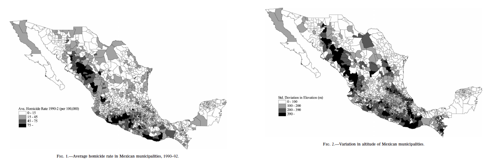
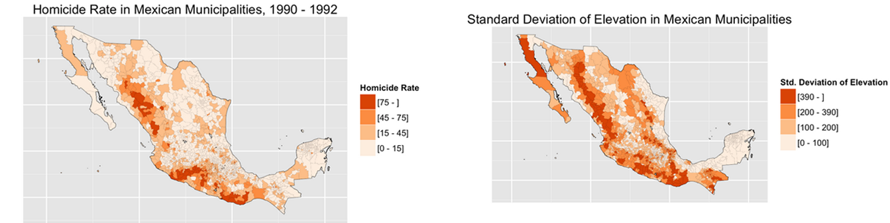
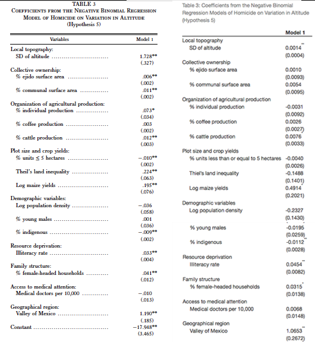
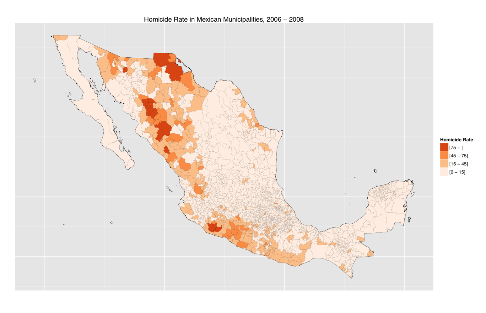
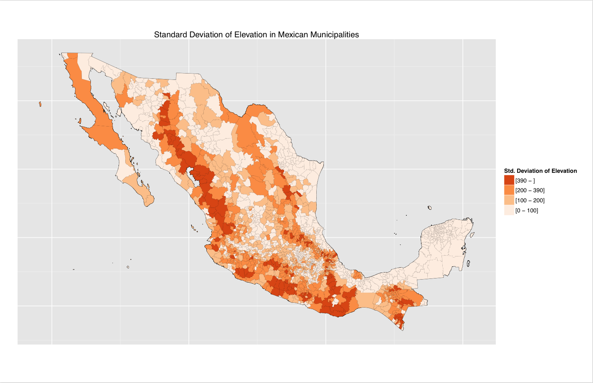

##Reproduction and Extension

 "The Social Ecology of Rural Violence: Land Scarcity, 
 the Organization of Agricultural Production, and the 
 Presence of the State." *American Journal of Sociology*, 2004.

*Andrés Lajous and Leah Reisman*

##Data Cleaning Galore {.smaller}

```{r, results = 'hide', warning=FALSE, error=FALSE, message=FALSE, echo=FALSE}
library(dplyr)
library(readr)
```

```{r, warning=FALSE, error=FALSE, eval=FALSE}
homicides <- read_csv(file="data/homicide_1990_2013_INEGI.csv", col_names = FALSE, skip = 6)

## new coloumn names, default were unreadable
colnames(homicides) <- c("muncode", "name", 2013:1990)
homicides[is.na(homicides)] <- 0

##clean out NAs and others, 
homicides <- homicides %>%
  filter(!grepl("996|997|998|991|993|992", muncode), muncode > 1000) %>%
  select(muncode, name, `2008`:`2006`) %>%
  mutate(hom_total = `2006` + `2007` + `2008`) %>%
  select(-`2006`, -`2007`, -`2008`, -name)
```

##Matching on Names {.smaller}

```{r, warning=FALSE, error=FALSE, eval=FALSE}
## all names have to be fixed so that they can be joined by 
#name to the agr variables which don't have muncode.
total_pop$mun.name <- gsub("\xed", "i", total_pop$mun.name)
total_pop$mun.name <- gsub("\xfa", "u", total_pop$mun.name)
total_pop$mun.name <- gsub("\xf3", "o", total_pop$mun.name)
total_pop$mun.name <- gsub("\xe9", "e", total_pop$mun.name)
total_pop$mun.name <- gsub("\xe1", "a", total_pop$mun.name)
total_pop$mun.name <- gsub("\xfc\xbe\x98\xb6\x98\xbc", "u", total_pop$mun.name)
total_pop$mun.name <- gsub("\xc1", "A", total_pop$mun.name)
total_pop$mun.name <- gsub("\xfc\xbe\x8c\x96\x98\xbc", "n", total_pop$mun.name)

total_pop$state.name <- gsub("\xed", "i", total_pop$state.name)
total_pop$state.name <- gsub("\xfa", "u", total_pop$state.name)
total_pop$state.name <- gsub("\xf3", "o", total_pop$state.name)
total_pop$state.name <- gsub("\xe9", "e", total_pop$state.name)
total_pop$state.name <- gsub("\xe1", "a", total_pop$state.name)

total_pop$mun.name <- toupper(total_pop$mun.name)
total_pop$state.name <- toupper(total_pop$state.name)
```

##Functions are Your Friend {.smaller}

```{r}
naming <- function(df) {
df <- df %>%
  rename(mun.name = X1)

  ## standardizes state names
  df$state.name <- gsub("`|\\'", "", iconv(df$state.name, to="ASCII//TRANSLIT"))
  df$state.name <- gsub("COAHUILA DE ZARAGOZA", "COAHUILA", df$state.name)
  df$state.name <- gsub("VERACRUZ LLAVE", "VERACRUZ", df$state.name)
  df$state.name <- gsub("MICHOACAN DE OCAMPO", "MICHOACAN", df$state.name)

  ## removes accents and tilde in municipal names
  df$mun.name<- gsub("`|\\'", "", iconv(df$mun.name, to="ASCII//TRANSLIT"))
  df$mun.name <- gsub("~","", df$mun.name)
  df$mun.name <- gsub("¨","", df$mun.name)
  df$mun.name <- gsub("~","", df$mun.name)
  df$mun.name <- gsub("\"","", df$mun.name)
  df$mun.name <- trim(df$mun.name)
  df$state.name <- trim(df$state.name)
  df <- df %>%
    mutate(name = paste(mun.name, state.name, sep = ", "))
}
```

##Primary Finding {.smaller}
Association between Homicide Rates and State Presence (SD of Elevation) 




##Unable to Reproduce Results {.smaller}



##Why? Data Problems! {.smaller}

*Pct.up5, Thiel Index, Log average plot size* - This variable has 45 NAs, more than acceptable according to Villarreal's regressions. This indicates that something may be wrong with the data on plot size, which would affect the Thiel index, log average plot size, and the variable regarding plots 5 HA or less. 

Upon further investigation, we discovered that this is true--Mexican data privacy laws changed in 2003 which rendered a good portion of the plot size data unreportable (due to the potential to identify landowners with large swaths of land in particular municipalities). Since Villarreal's paper was produced in 2001, he would have received different data on plot size without these redactions.

-*Individual Production* - unsure whether we used the right field for this

-*Cattle* - unsure which total to use (multiple distinct totals regarding head of cattle on different spreadsheets)

##Extension

- Removed variables with identified issues, added new variables to replace them
  * HDI instead of illiteracy rate as a proxy for poverty
  * Gini Index instead of Thiel Index
  * Police per 1,000 people as additional measure of state presence


- Also updated the data
  * Villarreal's paper used 1990-91 data, we used 2007-10

##Results {.smaller}
  Association between State Presence and Homicide Rate Disappears!

 

##What We Learned

- Lots of decision-making when choosing variables as proxies

- Lots of consequential decision-making when cleaning messy data

- Change over time matters!